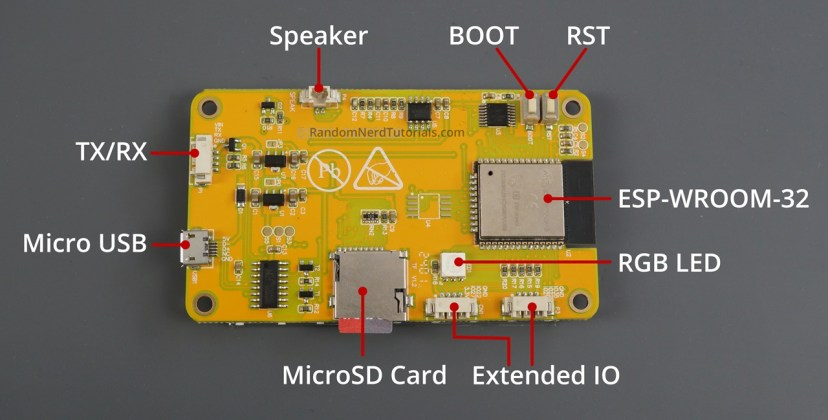

# ADS-B Radar — CYD Edition

A real-time aircraft radar display for the **ESP32-2432S028** (aka "Cheap Yellow Display" / CYD). Tracks aircraft using the ADS-B Exchange API and displays them on a 320x240 TFT screen with touch interaction.

No PSRAM required. No LVGL. Just direct TFT_eSPI rendering on a $15 board.

## Features

- **Radar view** — sweeping radar with aircraft blips, trails, heading lines, and sweep-based fading
- **Arrivals board** — tabular list with callsign, route, altitude, speed, distance
- **Stats dashboard** — uptime, WiFi, fetch stats, closest/highest/fastest aircraft
- **Flight log** — circular buffer of 50 recently seen aircraft
- **Detail view** — full aircraft info (type, operator, route, squawk, IAS/TAS/Mach)
- **Settings screen** — configure auto-cycle, alerts, trails via touch (persisted to NVS)
- **Compass rose** — N/S/E/W labels on radar
- **Auto-cycle** — automatically rotates views, pauses on touch
- **Brightness control** — PWM backlight, adjustable from stats view
- **Night mode** — amber/red palette, long-press to toggle
- **Filters** — cycle through ALL/COM/MIL/EMG/HELI/FAST/SLOW/ODD
- **Sort modes** — arrivals sortable by distance, altitude, or speed
- **Mil/Emergency alerts** — flashing border + banner on military/emergency aircraft
- **Closest approach record** — tracks the nearest aircraft ever seen

## Hardware

- **ESP32-2432S028** (ESP32-WROOM-32 with 2.8" ILI9341 320x240 TFT + XPT2046 touch)
- Available on AliExpress/Amazon for ~$15
- No additional wiring needed — everything is on-board

### Board layout



Key components (viewing the back of the board):
- **Micro USB** (left side) — for power, programming, and serial monitor
- **BOOT button** — near the center of the board, next to the speaker
- **RST button** — top-right corner
- **ESP-WROOM-32** — the metal-shielded module on the right

## Setup

### 1. Install PlatformIO

Install [VS Code](https://code.visualstudio.com/) and the [PlatformIO extension](https://platformio.org/install/ide?install=vscode), or install the CLI:

```bash
pip install platformio
```

### 2. Install USB drivers

Your CYD has a **CH340** USB-to-serial chip for programming. Some board variants also include a **CP2102** chip, but the CH340 is the one used for flashing.

- **CH340** — [download from manufacturer](http://www.wch-ic.com/downloads/CH341SER_ZIP.html) (Windows/Mac/Linux)
- **CP2102** (if your board has one) — [download from Silicon Labs](https://www.silabs.com/developers/usb-to-uart-bridge-vcp-drivers)

Most Linux distros include both drivers already. On Windows/Mac, install the driver **before** plugging in the board.

**Linux only:** Add yourself to the `dialout` group so you can access the serial port:

```bash
sudo usermod -aG dialout $USER
```

Then **log out and back in** (or reboot) for this to take effect.

### 3. Clone this repo

```bash
git clone https://github.com/iamneilroberts/adsb-cyd.git
cd adsb-cyd
```

### 4. Configure your location

Edit `src/config.h` and set your WiFi credentials and home coordinates:

```c
#define WIFI_SSID "YourWiFiName"
#define WIFI_PASS "YourWiFiPassword"

#define HOME_LAT 30.6905    // Your latitude
#define HOME_LON -88.1632   // Your longitude
```

You can find your coordinates at [latlong.net](https://www.latlong.net/).

### 5. Connect the CYD

Plug in the CYD via the **Micro USB** port (left side of the board, when viewing from the back). **Use a data cable, not a charge-only cable** — if the board isn't detected, the cable is the most likely cause.

Verify the board is detected:

- **Linux:** `ls /dev/ttyUSB*` — you should see `/dev/ttyUSB0`
- **Mac:** `ls /dev/cu.usbserial*` or `ls /dev/cu.wchusbserial*`
- **Windows:** Open Device Manager → Ports — look for "USB-SERIAL CH340" or "CP210x"

### 6. Know your buttons

Refer to the [board layout photo](#board-layout) above. The two buttons on the back are:

- **BOOT** — closer to the center of the board (near the speaker)
- **RST** (Reset) — in the top-right corner

You may need these during flashing (see step 7).

### 7. Build and flash

```bash
pio run -e cyd -t upload
```

If the upload fails with a connection error, try holding the **BOOT** button:

1. Hold **BOOT**
2. While holding BOOT, press and release **RST**
3. Release **BOOT**
4. Run the upload command within a few seconds

If the upload fails because it can't find the port, specify it explicitly:

```bash
# Linux
pio run -e cyd -t upload --upload-port /dev/ttyUSB0

# Mac
pio run -e cyd -t upload --upload-port /dev/cu.usbserial-XYZ

# Windows
pio run -e cyd -t upload --upload-port COM3
```

### 8. Verify it works

After flashing, the CYD will reboot and show a startup screen. It will:

1. Connect to your WiFi (the screen shows connection status)
2. Start fetching aircraft data
3. Display the radar view with any aircraft in range

If the screen stays white or blank, double-check your WiFi credentials in `src/config.h` and re-flash.

### 9. Monitor serial output (optional)

To see debug output and connection info:

```bash
pio device monitor
```

## Troubleshooting

| Problem | Solution |
|---------|----------|
| Board not detected (no `/dev/ttyUSB*` or COM port) | Try a different USB cable — charge-only cables won't work. Install the CH340 or CP2102 driver (see step 2). |
| "Permission denied" on Linux | Run `sudo usermod -aG dialout $USER`, then log out and back in. |
| Upload fails with "connection timeout" or "invalid head of packet" | Put the board in download mode: hold **BOOT**, press and release **RST**, release **BOOT**, then upload within a few seconds. |
| Upload still fails after BOOT/RST | Try a lower baud rate: add `upload_speed = 115200` to `platformio.ini`. Also try a different USB cable. |
| "Invalid head of packet" every time | Some CYD boards have two serial chips (CH340 + CP2102). The CH340 is the programming port. If you see two `/dev/ttyUSB*` devices, try the other one. On Linux, run `lsusb` to identify which is which. |
| Screen is white/blank after flash | Check WiFi credentials in `src/config.h`. Open serial monitor (`pio device monitor`) to see error messages. |
| No aircraft showing | Verify your coordinates are correct. Make sure you're within range of aircraft (75nm default). The free API may have brief outages — wait a minute and check again. |

## Touch Controls

The screen is divided into three vertical zones: **left 45%**, **center 10%**, **right 45%**. The narrow center zone prevents accidental view changes. Tap for a short press, or hold for 1 second for a long press.

| View | Left tap | Center tap | Center HOLD (1s) | Right tap |
|------|----------|------------|------------------|-----------|
| **Radar** | Cycle filter (ALL → COM → MIL → EMG → HELI → FAST → SLOW → ODD) | Next view | — | Cycle range (150 → 100 → 50 → 20 → 5nm) |
| **Arrivals** | Cycle sort (DST → ALT → SPD) | Tap aircraft row → Detail view | — | Cycle range |
| **Stats** | Brightness down (-12%) | Next view | Toggle night mode (green/amber) | Brightness up (+12%) |
| **Log** | Previous page | Next view | — | Next page |
| **Settings** | Previous setting | Next view | Toggle/change selected setting | Next setting |
| **Detail** | Previous aircraft | Back to Radar | — | Next aircraft |

**View cycle:** Radar → Arrivals → Stats → Log → Settings → Radar

**Detail view** is not part of the normal cycle — tap an aircraft row in the Arrivals list to open it.

## Settings Screen

Navigate to the settings screen by tapping through views (Radar → Arrivals → Stats → Log → **Settings**).

- Tap **left/right** to highlight a setting
- **Long-press middle** (hold for 1 second) to toggle or cycle the value
- Changes save to flash immediately and persist across reboots

Available settings:
| Setting | Values |
|---------|--------|
| Auto Cycle | ON / OFF |
| Cycle Interval | 15s / 30s / 60s / 90s |
| Inactivity Pause | 30s / 60s / 120s |
| Alert Military | ON / OFF |
| Alert Emergency | ON / OFF |
| Trails | ON / OFF |
| Trail Style | LINE / DOTS |

## Data Sources

- **Aircraft positions:** [api.adsb.lol](https://api.adsb.lol) (free, no API key)
- **Enrichment data:** [adsbdb.com](https://www.adsbdb.com) (callsign/aircraft lookups)

## Flash Usage

```
RAM:   19.8% (64KB / 320KB)
Flash: 88.0% (1.15MB / 1.31MB) — ~157KB free
```

## License

MIT
